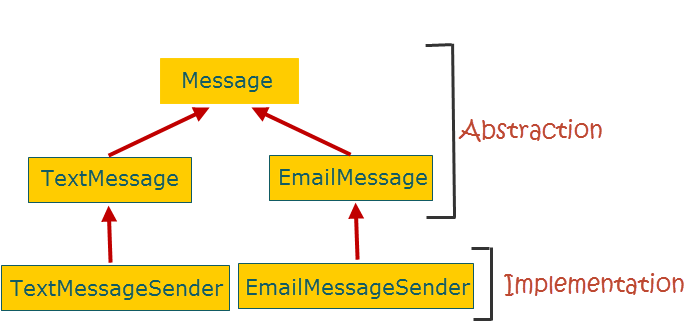
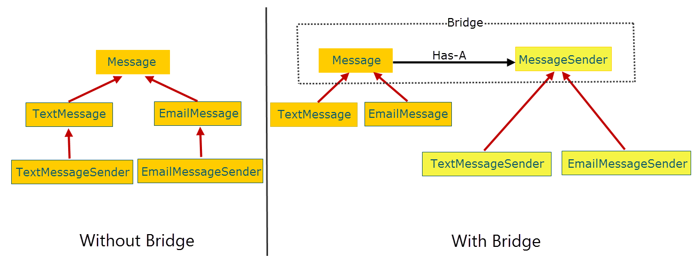

## 23种设计模式
 DesignPattern

### bridge pattern 桥接模式
#### 意图
   将抽象和实现分离，使他们可以独立的变化(用组合/聚合代替继承)
#### 适用地方
* 你不希望在抽象和他的实现部分之间有一个固定的邦定关系，如在程序的运行时刻实现部分应该可以被选择或者切换
* 类的抽象以及他的视像都可以通过生成子类的方法加以扩充。这时bridge模式使你可以对不同的抽象接口和实现部分进行组合，并对他们进行扩充
* 对一个抽象的实现部分的修改应该对客户不产生影响，即客户的代码不需要重新编译
* 你想对客户完全隐藏抽象的实现部分
* 你想在多个实现间 共享实现，但同时要求客户并不知道这一点

#### 实现
######  Bridge模式的参与者
要了解网桥模式如何工作，请考虑客户端可用于发送不同类型的消息（如文本或电子邮件）的消息传递应用程序。最直观的方法是首先创建一个接口或抽象基类，Message。接下来，我们创建派生类：TextMessage和EmailMessage。最后，为了发送消息，我们创建了两个消息发送者类：TextMessageSender扩展TextMessage和EmailMessageSender扩展EmailMessage。这就是我们的继承层次结构

乍一看，上面的设计中没有出现错误。但是如果你看起来很深刻，你会注意到，抽象部分 - 客户端与之交互的部分，以及实现部分 - 提供发送消息核心功能的部分紧密集成。我们的设计依赖于继承，一个固有的缺点是它打破了封装。作为EmailMessageSender子类的开发人员，您必须了解EmailMessage超类的内部，这意味着超类中的封装被破坏。

我们的设计也很脆弱。例如，如果我们更改实现以允许客户端在发送之前选择性地加密消息，则需要更新抽象部分以使客户端可以使用加密功能。

另一个问题是可重用性。如果我们想在其他应用程序中只重用实现（消息发送）部分，我们将不得不将抽象部分作为额外的行李。

桥接模式通过将抽象和实现分为两个类层次结构来解决所有这些问题。该图显示了没有和具有桥式样的设计。

通过桥接模式，抽象与实现保持一种Has-A关系，而不是IS-A关系。所述具有-A关系通过其中的抽象保持的执行和转发客户端请求到它的参考组合物来实现的。

让我们总结消息传递示例中桥接模式的参与者：

* Abstraction（Message）：接口是否实现为与客户端通信的抽象类。
* RefinedAbstraction（TextMessage和EmailMessage）：是实现或扩展抽象的类。
* Implementor（MessageSender）：是实现类层次结构的接口。
* ConcreteImplementor（TextMessageSender和EmailMessageSender）：是实现Implementor的具体子类。

###### 应用

