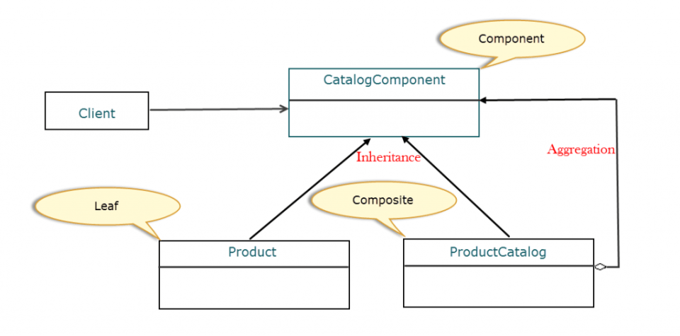

## 23种设计模式
 DesignPattern

### composite pattern 桥接模式
#### 意图
   将对象组成树结构来表示部分 - 整体层次结构。Composite让客户可以统一处理单个对象和对象组合
#### 适用地方
* 创建这种分层树结构的挑战是为客户提供一种统一的方式来访问和操作树的对象。
* 客户端应该不知道是否正在对叶节点或节点执行任何操作，这就是复合设计模式出现的位置。例如，组合设计模式可以确保添加或删除目录（节点）的过程以及文件（叶）对于用户而言保持不变。

复合模式的参与者
要了解复合模式的工作方式，请考虑购物商店，它提供了一个目录，以帮助用户在购买前浏览产品。最初，购物商店内部制造的产品很少。随着扩张，逐渐增加了几种产品，其中一些产品是从其他制造商购买的。对于不同类别的产品，子目录已创建，并且一些子目录还具有其自己的子目录。这里的要求是在一个主目录中有效地组织产品和子目录。对于这样的要求，我们有复合模式。

让我们来回顾一下GoF作者对复合模式的看法。

“ 撰写物体插入树结构以表示部分-整体层次结构 ”：一个部分-整体层次结构是由所谓的更小的单个对象的零件和较大的物体称为整体而那些聚集零件。模式所说的是 - 对于部分 - 整体层次结构，创建树结构来表示部件和整体之间的关系。
“ Composite允许客户统一处理单个对象和对象组合 ”：这意味着客户应该能够对对象（批量）和单个对象（部件）的聚合应用相同的操作。
要将复合模式应用于目录示例，我们可以创建一个树结构（颠倒），并将树的根作为抽象类来建模CatalogComponent。该类定义了单个对象和复合对象的行为，并充当树对客户端的接口。请注意，我们也可以使用Java接口，但在我们的示例中，这会强制树下的类提供与它们无关的方法的实现。例如，产品的getProductDiscount()方法与目录无关，我们不希望目录实现它。

接下来，我们需要创建一个类来模拟树叶，Product一个模型树节点ProductCatalog。

让我们看看我们的类如何映射到复合模式的参与者：

Component（CatalogComponent）：树结构中对象的抽象基类。该类为所有对象和行为定义访问和管理树中子组件的默认行为。
Leaf（Product）：是一个扩展Component的类，用于在没有任何子项的树结构中表示叶子。
Composite（ProductCatalog）：扩展Component以表示树结构中的节点（包含子节点）的类。该类存储Leaf组件并实现组件中定义的行为以访问和管理子组件。如前所述，子组件可以是一个或多个Leaf或其他复合组件。
客户端：与组件交互以访问和操作组合中的对象。
这是目录示例的类层次结构的方式。

