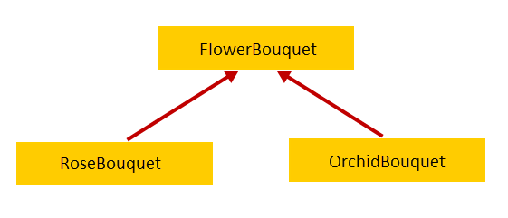
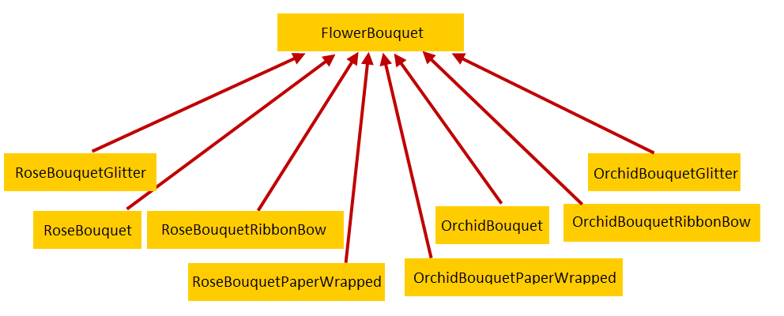
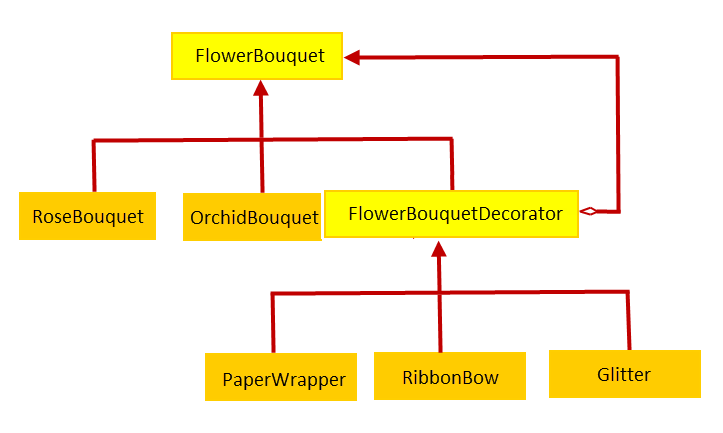

## 23种设计模式
 DesignPattern

### decorator pattern 装饰模式
#### 意图
   动态的给一个对象添加一些额外的职责,就增加功能而言,Decorator模式比生成子类更加灵活
#### 简介
* 我们所了解的经典四人组结构模式（Adapter，Bridge和Composite）的共同目标是确定如何以简单而灵活的方式实现类和对象之间的复杂关系。装饰者模式也有相同的目标，但解决了不同的问题领域。
* 在考虑扩展功能的同时，新程序员可能会遇到的第一件事是继承。但是，在所有情况下，继承可能不是理想的解决方案。当通过子类继承功能时，功能在编译时静态设置，并不总是导致最灵活和可维护的设计。如果您需要添加新功能，则需要修改代码，这违反了开放式封闭原则。
* 相反，您可以动态地将新责任附加到对象上。这正是装饰者模式的预期用途。
* 每四人帮 - “ 将动态附加责任附加到对象上 ”。但你如何做到这一点？通过使用组合。通过组合，您可以在运行时动态地将多个新职责添加到对象。这里最棒的是对象不需要知道它，而且你的设计符合开放闭合原则。我们经常期待Java等优秀的面向对象的编程语言，同时忽略使用组合来解决问题的简单性。

#### 装饰模式的参与者
考虑卖花束的花店，比如玫瑰花束，兰花花束等等。当一位顾客走进来时，花店介绍花束并告诉他们的价格。我们可以使用FlowerBouquet抽象基类和特定花束的子类对需求进行建模。

除了一束花以外，顾客还可以要求花店用纸包装，蝴蝶结和闪光花朵装饰花店，花店额外收费。为了满足新的要求，我们可以添加FlowerBouquet的新子类，每个子类代表一束具有额外装饰的花束，这就是我们的设计现在的样子。

我们所拥有的是“ 阶级爆炸 ”，同时也只为花束添加单一装饰。想象一下，用多种装饰来表现一束花，例如带着蝴蝶结和闪烁的玫瑰花束，或者带有纸裹，蝴蝶结和闪光的兰花花束。一些更多的考虑：

如果我们想用双层纸包装玫瑰花束怎么办？
如果我们想添加一个新的百合花束怎么办？
如果我们想添加新的观赏树叶装饰怎么办？
显然，我们的设计是有缺陷的，但这是装饰者模式的理想用例。通过使用装饰器模式，我们可以创建花束并在运行时用任意数量的功能动态装饰它。没有花束知道它是“ 正在装饰 ”。为此，我们将创建一个抽象基类FlowerBouquet和特定的子类RoseBouquet和OrchidBouquet以扩展它。我们还将创建一个抽象的FlowerBouquetDecorator类来扩展FlowerBouquet。对于每个装饰器，我们将创建Glitter，PaperWrapper和RibbonBow类来扩展FlowerBouquetDecorator。这就是设计的方式。

带装饰模式的类图

在上图中，最重要的是观察FlowerBouquet和FlowerBouquetDecorator之间的关系。我们有两种关系：

* 通过对FlowerBouquet中的FlowerBouquetDecorator进行分类来继承，以获得正确的类型。
* 通过用FlowerBouquet创作FlowerBouquetDecorator来创作，以添加新的行为。

现在让我们看看我们的类如何映射到装饰器模式的参与者：

* 组件（FlowerBouquet）：是一个抽象的基类，可以动态地用职责来装饰。
* ConcreteComponent（RoseBouquet和OrchidBouquet）：是扩展Component以表示可以附加额外职责的对象的具体类。
* 装饰器（FlowerBouquetDecorator）：是一个抽象类，它扩展了Component并充当具体装饰器类的基类。
* ConcreteDecorator（PapperWrapper，RibbonBow和Glitter）：是具体的类，它扩展装饰器来装饰具有责任的组件。

#### 代码看decorator

#### 结论
* 装饰器模式是一种很好的解决方案，可以在不使用子类的情况下动态地扩展行为，但通常会导致大量的装饰器类。
* 虽然在创建类和应用模式方面没有任何复杂性，但有时候新程序员可能会弄清楚并使用现有的基于装饰器的代码。
* 在java.io API在很大程度上是基于Decorator模式，现在你已经学会了，你会在易用性，同时包装输入和输出流与装饰类，如的BufferedInputStream和DataInputStream类。
* 此外，如果您觉得客户端可能会发现基于装饰器的代码复杂，则可以始终使用Factory Method来封装复杂性，抽象工厂，或生成器创建模式。

#### spring framework 应用
Decorator模式在使用Spring Framework 进行企业应用程序开发时也会使用。您经常需要执行任务，例如事务，缓存同步和安全相关任务。如果你不想冒着混淆业务代码的风险，使用装饰器。通常，使用装饰器模式会使您获得更清洁，更易维护的代码。

这个装饰器样例基于调用最终属性（在我们的例子中为价格和蜜饯级别）的父方法的调用。在Spring中，我们通过Spring处理与Spring管理的事务处理缓存同步的类来检索装饰器设计模式。这个类是org.springframework.cache.transaction.TransactionAwareCacheDecorator。

这个类的哪些特性证明它是org.springframework.cache.Cache对象的装饰器？首先，正如我们的咖啡例子一样，TransactionAwareCacheDecorator的构造函数接受参数装饰对象（Cache）：

   
    private final Cache targetCache;
    /**
     * Create a new TransactionAwareCache for the given target Cache.
     * @param targetCache the target Cache to decorate
     */
    public TransactionAwareCacheDecorator(Cache targetCache) {
      Assert.notNull(targetCache, "Target Cache must not be null");
      this.targetCache = targetCache;
    }
 

其次，一个新的行为被添加到装饰的缓存。正如我们可以在TransactionAwareCacheDecorator的注释中看到的，它的主要目的是在缓存和Spring事务之间提供同步级别。这是通过两种Cache方法中的org.springframework.transaction.support.TransactionSynchronizationManager实现的：put和evict：

    
        
       private final Cache targetCache;
       @Override
       public void put(final Object key, final Object value) {
         if (TransactionSynchronizationManager.isSynchronizationActive()) {
           TransactionSynchronizationManager.registerSynchronization(
             new TransactionSynchronizationAdapter() {
               @Override
               public void afterCommit() {
                 targetCache.put(key, value);
               }
           });
         }
         else {
           this.targetCache.put(key, value);
         }
       }
        
       @Override
       public void evict(final Object key) {
         if (TransactionSynchronizationManager.isSynchronizationActive()) {
                 TransactionSynchronizationManager.registerSynchronization(
                   new TransactionSynchronizationAdapter() {
                     @Override
                     public void afterCommit() {
                       targetCache.evict(key);
                     }
                 });
         }
         else {
           this.targetCache.evict(key);
         }
       }
   

这种模式看起来类似于适配器，不是吗？但是，它们都不同。正如我们所看到的，适配器使对象适应运行时环境，即。如果我们在JBoss 6中运行，我们使用不同于JBoss 7中的类加载器。装饰器每次都使用同一个主对象（Cache），并且仅向其添加新行为（与本例中的Spring事务同步）。

