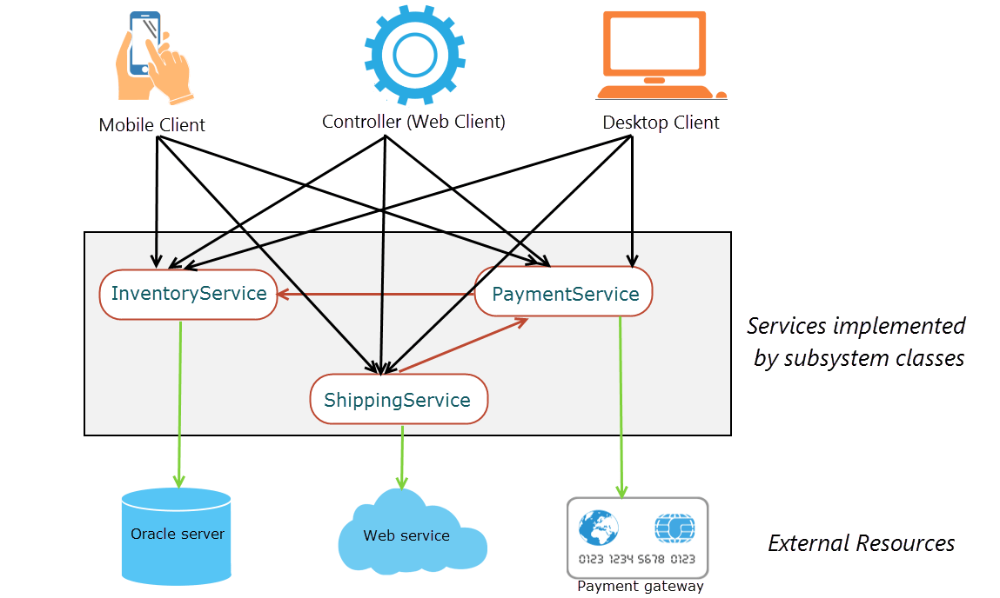
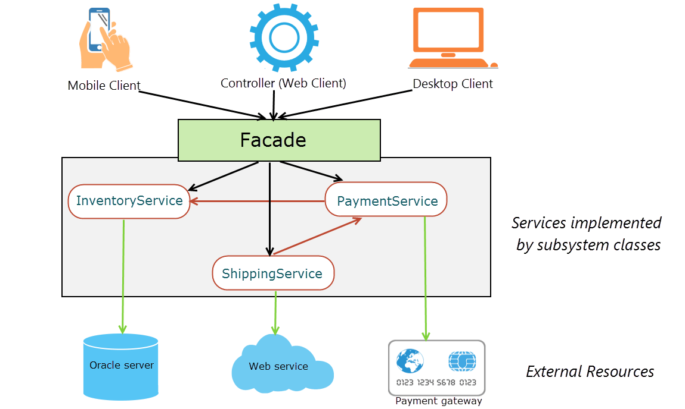

## 23种设计模式
 DesignPattern

### facade pattern 外观模式
#### 意图
   为子系统中的一组接口提供一个统一的接口,Facade 定义了一个更高级的界面,使的子系统更易于使用
#### 简介
facade模式是经典的四人组结构模式家族的一部分。我们已经了解了结构模式族中的其他模式 - Adapter，Bridge，Composite和Decorator。在这篇文章中，我们将学习Facade模式以及它如何简化客户端需要使用子系统类进行的交互。

当我们创建一个系统时，我们将它分成子系统以减少复杂性。我们按照单一职责原则为子系统类分配特定的职责。但是，子系统之间经常存在依赖关系。另外，客户单独与子系统类进行交互以满足业务需求可能会导致相当程度的复杂性。

考虑电子商务商店的订单履行流程。当用户下订单时，以下服务完成该过程：

* 库存服务：检查Oracle上运行的仓库数据库是否存在产品。
* 支付服务：连接支付网关以处理订单支付。
* 运输服务：连接外部物流网络服务，将产品从仓库运送到用户地址。
应用程序的控制器与前面的服务进行交互以获得订单。当用户与UI进行交互以下订单时，请求会映射到控制器，而控制器又会与服务交互以完成请求，然后通知用户有关执行状态。在真正的电子商务商店应用程序中，控制器通常是底层框架的专用组件，例如Spring MVC控制器。

我们的电子商务商店也支持移动客户端。用户可以下载客户端应用程序并从他们的设备下订单。传统桌面客户端还可以与商店进行通信，以继续支持希望通过客户服务助理在电话上下订单的用户。这就是不同的客户与电子商务商店的订单履行过程的交互方式。

如上图所示，客户端需要与子系统类实现的服务进行多次交互，为此，客户端需要了解子系统类的内部。这意味着，我们的客户与子系统类紧密结合 - 严重违反了SOLID设计原则。想象一下，如果底层数据存储需要更改为NoSQL数据库或当前支付网关被替换为另一个数据库，则会产生影响。如果在服务层或现有的ShippingService中引入新的InvoicingService，事情会变得更糟更新以使物流部分在组织内部。由于这种紧密耦合，服务层中的任何更改都会传播到客户端层。这使更改耗时且容易出错。

我们需要的是一个使子系统更易于使用的接口，而不是让客户端与子系统紧密耦合。在我们的例子中，我们的客户只想下订单。他们并不需要关心处理库存，运输或付款。Facade模式是为客户提供一种简单的方式与子系统交互的一种方式。通过正视工作，现在我们可以对子系统类进行更改，而不会影响客户端代码。总之，我们让客户与子系统类松散耦合。

通过外观，这就是不同客户与订单履行流程的互动方式。

正如您在上图中看到的那样，随着facade的引入，客户现在与facade交互以实现订单履行，而不是单独的子系统服务。Facade通过透明地处理来自客户端的与子系统服务的底层交互。

因此，我们可以将Facade模式的参与者分类为：

* Facade：将客户端请求委托给适当的子系统类。
* 子系统类：实现子系统功能。子系统类由外观使用，但不是其他方式。我们稍后会在这篇文章中谈到。
* 客户：请求face执行一些操作。

#### 代码看facade
要将门面模式应用于我们的订单履行示例，我们先从域类开始Product。
Product.java
我只保留了这个Product类，只有两个字段，一个构造函数来初始化它们，以及默认的构造函数。接下来我们将编写子系统服务类。

InventoryService.java
PaymentService.java
ShippingService.java
子系统类表示订单履行过程的不同服务。有一点需要注意的是子系统类没有引用外观。这些类不知道任何Facade，并且被设计为独立工作，即使不存在Facade也是如此。请记住 -  子系统类由外观使用，但不是相反。

就这个例子而言，我把服务班保持在最低限度。这仅用于说明目的。真正的电子商务例子会更复杂。

我们可以有一个没有任何接口的具体门面类 - 该模式没有强制要求。但是，我们将提供一个界面来跟踪 - “ 取决于抽象。不要依赖于总结依赖倒置原理的结论 “ 。通过这样做，我们可以让客户端针对此界面进行编程，从而通过外观与服务进行交互。将代码写入接口也会放松类之间的耦合。

OrderServiceFacade.java
在Facade中，我们实现了placeOrder()整合所有子系统交互的方法。在这种方法中，我们调用服务上的方法来执行完成订单的操作。

接下来，我们将编写控制器类 - 外观的客户端。

OrderFulfillmentController.java
OrderFulfillmentController我们写的客户类非常简单，因为它应该是。客户端控制器调用placeOrder()Facade 的方法并将结果存储在boolean。我经常看到初级程序员混淆了控制器类。在MVC设计模式中，控制器绝对没有业务直接与数据库层进行交互。在控制器类中直接使用JDBC数据源太常见了。这明显违反了单一责任原则。控制器具有单一用途，即响应Web请求。它不是调用数据库，也不是使用Hibernate，而是管理数据库事务。因为我们的控制器只有一个功能，所以很容易测试。
#### 结论
在GoF模式中，我发现Facade模式是最容易理解和应用的模式之一。其实，在我知道之前，我已经直观地应用了它。一旦你了解了Facade模式，你就会越来越认识到它在使用中。

程序员通常会将Facade模式与Adapter模式混淆。请记住，Facade通常是为了减少与子系统接口的复杂性，而Adapter则更适合将现有接口调整到客户期望使用的另一个接口。

在Spring开发的企业应用程序中，门面通常用于整合应用程序提供给用户的所有业务服务。在Spring应用程序中，您将经常开发业务和服务外观，作为业务逻辑和应用程序服务层的入口。为了持久化，您将编写DAO，这是一种外观，但是特定于数据层。虽然我保留了这个有意通用的例子，但你应该能够看到在IoC和依赖注入的背景下，这将如何与Spring很好地协作。
